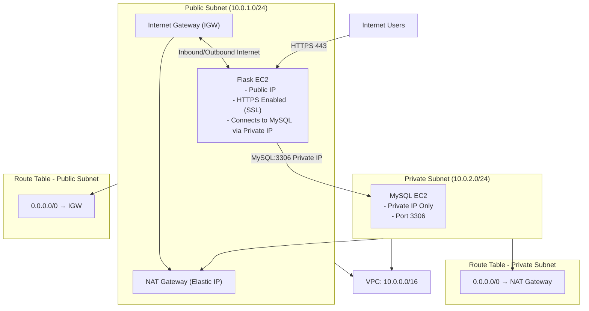

# Full step-by-step guide — **Console (GUI)** + **AWS CLI** (both), from scratch

---
# ✅ **HLD Diagram — Flask (Public) + MySQL (Private) + NAT + SSL**


---
# 0 — Variables you must set (replace before running CLI)

```
REGION="us-east-1"
VPC_CIDR="10.0.0.0/16"
PUB_SUBNET_CIDR="10.0.1.0/24"
PRIV_SUBNET_CIDR="10.0.2.0/24"
AVAILABILITY_ZONE="${REGION}a"
KEY_NAME="my-ec2-key"               # must exist in your account or create one
AMI="ami-0abcdef1234567890"         # replace by Ubuntu 22.04 AMI for your region
INSTANCE_TYPE="t3.micro"
MY_ADMIN_IP="203.0.113.5/32"        # replace with your office/home IP for SSH
DOMAIN="app.example.com"            # domain you own (for SSL)
EMAIL="admin@example.com"           # certbot contact email
```

---

# 1 — High-level architecture (what we'll create)

* VPC (10.0.0.0/16)

  * Public subnet (10.0.1.0/24) — NAT Gateway, Flask EC2 (public IP/EIP), IGW route
  * Private subnet (10.0.2.0/24) — MySQL EC2 (no public IP), route to NAT Gateway
* Internet Gateway (IGW) attached to VPC
* NAT Gateway in public subnet (with Elastic IP)
* Route table: public → IGW; private → NAT Gateway
* Security Groups: `sg-flask`, `sg-mysql` (sg-mysql allows 3306 only from sg-flask)
* Flask uses nginx + certbot (Let's Encrypt) + Gunicorn; connects over private IP to MySQL

---

# 2 — Console (GUI) steps — quick checklist + exact clicks

### 2.1 Create VPC

1. Go to **VPC** → **Your VPCs** → **Create VPC**

   * IPv4 CIDR block: `10.0.0.0/16`
   * Name tag: `flask-mysql-vpc`
   * Create.

### 2.2 Create Subnets

1. **Subnets** → **Create subnet**

   * Name: `public-subnet`
   * VPC: `flask-mysql-vpc`
   * AZ: choose `REGIONa`
   * IPv4 CIDR: `10.0.1.0/24`
   * Create.
2. Repeat for `private-subnet` with CIDR `10.0.2.0/24`.

### 2.3 Internet Gateway

1. **Internet Gateways** → **Create internet gateway** → Name: `flask-igw` → Create → **Actions** → **Attach to VPC** → choose `flask-mysql-vpc`.

### 2.4 Route table (public)

1. **Route Tables** → **Create route table** → Name: `rtb-public` → VPC: `flask-mysql-vpc` → Create.
2. Select `rtb-public` → **Edit routes** → **Add route**: Destination `0.0.0.0/0`, Target: `flask-igw`. Save.
3. **Subnet Associations** → **Edit subnet associations** → choose `public-subnet`. Save.

### 2.5 Elastic IP + NAT Gateway

1. **Elastic IPs** → Allocate Elastic IPv4 address → Allocate.
2. **NAT Gateways** → Create NAT Gateway → Subnet: `public-subnet`, Elastic IP: choose the one allocated → Create.

   * Wait until state becomes **Available**.

### 2.6 Route table (private)

1. **Route Tables** → **Create route table** → Name: `rtb-private` → VPC: `flask-mysql-vpc`.
2. Select `rtb-private` → **Edit routes** → Add route: Destination `0.0.0.0/0`, Target: select NAT Gateway you created.
3. **Subnet Associations** → Associate with `private-subnet`.

### 2.7 Security Groups

1. **EC2** → **Security Groups** → Create security group `sg-flask` in your VPC

   * Inbound rules:

     * SSH (TCP 22) Source: **Your IP** (e.g., `203.0.113.5/32`)
     * HTTP (TCP 80) Source: `0.0.0.0/0` (or restrict to office IP for bonus)
     * HTTPS (TCP 443) Source: `0.0.0.0/0` (or restrict)
   * Outbound: leave default (All traffic).
2. Create `sg-mysql` in same VPC

   * Inbound rules:

     * MySQL/Aurora (TCP 3306) Source: **Security group** `sg-flask` (choose "Custom" → "Select security group" and pick `sg-flask`)
     * SSH (TCP 22) Source: **Your IP** (for admin)
   * Outbound: leave default.

> **Important:** referencing a security group as source is the AWS best practice: it allows any instance with `sg-flask` to access MySQL on 3306 without specifying private IP ranges.

### 2.8 Launch EC2 Instances

1. Launch **MySQL EC2** (private):

   * **Launch Instance** → AMI: Ubuntu 22.04 LTS (or Amazon Linux 2) → Instance type `t3.micro`
   * Configure instance: Network: `flask-mysql-vpc`, Subnet: `private-subnet`, Auto-assign Public IP: **Disable**
   * Add Storage: default
   * Tags: Name = `mysql-private`
   * Security group: `sg-mysql`
   * Key pair: choose `KEY_NAME`
   * Advanced: paste **MySQL user-data** (I’ll provide script below) if you want bootstrapping. Launch.
2. Launch **Flask EC2** (public):

   * Same AMI & instance type
   * Network: `flask-mysql-vpc`, Subnet: `public-subnet`, Auto-assign Public IP: **Enable** (or later assign EIP)
   * Tags: Name = `flask-public`
   * Security group: `sg-flask`
   * Key pair: `KEY_NAME`
   * Advanced: paste **Flask user-data** (script below) but you'll need MySQL private IP — better to fill after MySQL IP is known (or use SSM/Tags approach). Launch.
---

# 3 — CLI (AWS CLI) full step-by-step (copy-paste). **Do this in order.**

> Precondition: AWS CLI configured (`aws configure`) and you have permission to create VPCs, EC2, IGW, NAT, EIP, security groups.

### 3.1 Create VPC, subnets, IGW, route tables, NAT

```bash
REGION="us-east-1"
VPC_CIDR="10.0.0.0/16"
PUB_SUBNET_CIDR="10.0.1.0/24"
PRIV_SUBNET_CIDR="10.0.2.0/24"
AZ="${REGION}a"

# Create VPC
VPC_ID=$(aws ec2 create-vpc --cidr-block $VPC_CIDR --query 'Vpc.VpcId' --output text --region $REGION)
aws ec2 create-tags --resources $VPC_ID --tags Key=Name,Value=flask-mysql-vpc --region $REGION
echo "VPC_ID=$VPC_ID"

# Enable DNS hostnames (useful for internal DNS)
aws ec2 modify-vpc-attribute --vpc-id $VPC_ID --enable-dns-hostnames "{\"Value\":true}" --region $REGION

# Create public subnet
PUB_SUBNET_ID=$(aws ec2 create-subnet --vpc-id $VPC_ID --cidr-block $PUB_SUBNET_CIDR --availability-zone $AZ --query 'Subnet.SubnetId' --output text --region $REGION)
aws ec2 create-tags --resources $PUB_SUBNET_ID --tags Key=Name,Value=public-subnet --region $REGION
echo "PUB_SUBNET_ID=$PUB_SUBNET_ID"

# Create private subnet
PRIV_SUBNET_ID=$(aws ec2 create-subnet --vpc-id $VPC_ID --cidr-block $PRIV_SUBNET_CIDR --availability-zone $AZ --query 'Subnet.SubnetId' --output text --region $REGION)
aws ec2 create-tags --resources $PRIV_SUBNET_ID --tags Key=Name,Value=private-subnet --region $REGION
echo "PRIV_SUBNET_ID=$PRIV_SUBNET_ID"

# Create and attach Internet Gateway
IGW_ID=$(aws ec2 create-internet-gateway --query 'InternetGateway.InternetGatewayId' --output text --region $REGION)
aws ec2 attach-internet-gateway --internet-gateway-id $IGW_ID --vpc-id $VPC_ID --region $REGION
aws ec2 create-tags --resources $IGW_ID --tags Key=Name,Value=flask-igw --region $REGION
echo "IGW_ID=$IGW_ID"

# Create route table for public subnet and add route to IGW
RTB_PUB=$(aws ec2 create-route-table --vpc-id $VPC_ID --query 'RouteTable.RouteTableId' --output text --region $REGION)
aws ec2 create-route --route-table-id $RTB_PUB --destination-cidr-block 0.0.0.0/0 --gateway-id $IGW_ID --region $REGION
aws ec2 associate-route-table --route-table-id $RTB_PUB --subnet-id $PUB_SUBNET_ID --region $REGION
aws ec2 create-tags --resources $RTB_PUB --tags Key=Name,Value=rtb-public --region $REGION
echo "RTB_PUB=$RTB_PUB"

# Allocate Elastic IP for NAT
EIP_ALLOC_ID=$(aws ec2 allocate-address --domain vpc --query 'AllocationId' --output text --region $REGION)
echo "EIP_ALLOC_ID=$EIP_ALLOC_ID"

# Create NAT Gateway in public subnet
NAT_GW_ID=$(aws ec2 create-nat-gateway --subnet-id $PUB_SUBNET_ID --allocation-id $EIP_ALLOC_ID --query 'NatGateway.NatGatewayId' --output text --region $REGION)
echo "NAT_GW_ID=$NAT_GW_ID"
# Wait for NAT to be available (this can take ~30-120s)
echo "Waiting for NAT gateway to become available..."
aws ec2 wait nat-gateway-available --nat-gateway-ids $NAT_GW_ID --region $REGION
echo "NAT available"

# Create private route table and route 0.0.0.0/0 -> NAT
RTB_PRIV=$(aws ec2 create-route-table --vpc-id $VPC_ID --query 'RouteTable.RouteTableId' --output text --region $REGION)
aws ec2 create-route --route-table-id $RTB_PRIV --destination-cidr-block 0.0.0.0/0 --nat-gateway-id $NAT_GW_ID --region $REGION
aws ec2 associate-route-table --route-table-id $RTB_PRIV --subnet-id $PRIV_SUBNET_ID --region $REGION
aws ec2 create-tags --resources $RTB_PRIV --tags Key=Name,Value=rtb-private --region $REGION
echo "RTB_PRIV=$RTB_PRIV"

# Confirm local route (auto present) for VPC communication
aws ec2 describe-route-tables --filters "Name=vpc-id,Values=$VPC_ID" --region $REGION
```
---

# 🔵 **MySQL EC2 — Manual Setup Commands (NO USER-DATA)**

SSH into MySQL EC2 via Bastion or SSM.

### **Install MySQL**

# 🟦 **STEP 1 — MySQL EC2 Setup**

### **1. Install MySQL Server**

```bash
sudo apt update -y
sudo apt install mysql-server -y
```

### **2. Secure MySQL**

```bash
sudo mysql_secure_installation
```

### **3. Create Database + User**

```bash
sudo mysql -u root -p
```

Inside MySQL:

```sql
CREATE DATABASE flaskdb;
CREATE USER 'flaskuser'@'%' IDENTIFIED BY 'StrongPass123!';
GRANT ALL PRIVILEGES ON flaskdb.* TO 'flaskuser'@'%';
FLUSH PRIVILEGES;
```

### **4. Allow remote access**

Edit MySQL config:

```bash
sudo nano /etc/mysql/mysql.conf.d/mysqld.cnf
```

Find:

```
bind-address = 127.0.0.1
```

Change to:

```
bind-address = 0.0.0.0
```

Restart MySQL:

```bash
sudo systemctl restart mysql
```

### **5. Security Group (VERY IMPORTANT)**

On MySQL EC2 → Security Group → Add inbound rule:

| Type  | Port | Source               |
| ----- | ---- | -------------------- |
| MySQL | 3306 | Flask EC2 private IP |

---

# 🟩 **STEP 2 — Flask EC2 Setup**

### **1. Install Python**

```bash
sudo apt update -y
sudo apt install python3 python3-pip -y
```

### **2. Create Flask App Directory**

```bash
mkdir ~/flaskapp
cd ~/flaskapp
```

### **3. Create app.py**

```bash
nano app.py
```

Paste:

```python
from flask import Flask
import mysql.connector

app = Flask(__name__)

@app.route("/")
def hello():
    return "Flask App Working with HTTPS + Nginx Reverse Proxy!"

@app.route("/db")
def db_test():
    conn = mysql.connector.connect(
        host="MYSQL_EC2_PRIVATE_IP",
        user="flaskuser",
        password="StrongPass123!",
        database="flaskdb"
    )
    cursor = conn.cursor()
    cursor.execute("SELECT 'Database Connected Successfully!'")
    result = cursor.fetchone()
    conn.close()
    return result[0]

if __name__ == "__main__":
    app.run(host='127.0.0.1', port=5000)
```

### **4. Install dependencies**

```bash
# Create virtual environment
python3 -m venv venv

# Activate it
source venv/bin/activate

# Now install packages safely
pip install flask mysql-connector-python
```

### **5. Run Flask**

```bash
python3 app.py
```

Test locally:

```bash
curl http://127.0.0.1:5000
```

---

# 🟨 **STEP 3 — Install & Configure Nginx Reverse Proxy**

### **1. Install Nginx**

```bash
sudo apt install nginx -y
```

### **2. Remove default config**

```bash
sudo rm /etc/nginx/sites-enabled/default
```

### **3. Create new reverse proxy config**

```bash
sudo nano /etc/nginx/sites-available/flask
```

Paste this:

```
server {
    listen 80;
    server_name _;

    location / {
        proxy_pass http://127.0.0.1:5000;
        proxy_set_header Host $host;
        proxy_set_header X-Real-IP $remote_addr;
    }
}
```

Enable config:

```bash
sudo ln -s /etc/nginx/sites-available/flask /etc/nginx/sites-enabled/
sudo systemctl restart nginx
```

Test:

```bash
curl http://localhost
```

You should see:

```
Flask App Working with HTTPS + Nginx Reverse Proxy!
```

---

# 🟥 **STEP 4 — Enable HTTPS using OpenSSL (Self-Signed SSL)**

### **1. Create SSL directory**

```bash
sudo mkdir /etc/nginx/ssl
cd /etc/nginx/ssl
```

### **2. Generate certificate + private key**

```bash
sudo openssl req -x509 -nodes -days 365 -newkey rsa:2048 \
-keyout flask.key -out flask.crt
```

Fill answers (common name = your EC2 public DNS).

### **3. Update Nginx config for SSL**

```bash
sudo nano /etc/nginx/sites-available/flask
```

Replace entire file:

```
server {
    listen 80;
    server_name _;

    # Redirect all HTTP -> HTTPS
    return 301 https://$host$request_uri;
}

server {
    listen 443 ssl;
    server_name _;

    ssl_certificate /etc/nginx/ssl/flask.crt;
    ssl_certificate_key /etc/nginx/ssl/flask.key;

    location / {
        proxy_pass http://127.0.0.1:5000;
        proxy_set_header Host $host;
        proxy_set_header X-Real-IP $remote_addr;
    }
}
```

### **4. Restart Nginx**

```bash
sudo systemctl restart nginx
```

---

# 🟪 **STEP 5 — Test End-to-End**

Open browser:

```
https://<YOUR_FLASK_EC2_PUBLIC_IP>/
```

You should see:

✔ Flask App
✔ Nginx reverse proxy
✔ HTTPS enabled
✔ MySQL reachable

Try DB test:

```
# CURL from flask ec2 
curl http://<PUBLIC_IP_FLASK_IP>/db
telnet PRIVATE_IP_MY_SQL 3306
```

You should see:

```
Database Connected Successfully!
```

---

**ScreenShots of working application**


---
