---

# 🟦 **End-to-End Azure Implementation: Flask (Public) + MySQL (Private) + NAT + SSL**

Below is the **complete architecture**, designed exactly like the AWS version but rewritten fully for Azure.

---

# 🟩 **1. High-Level Architecture Diagram — Azure Version (Mermaid)**

```mermaid
flowchart TD

    %% ========================
    %% Azure VNet + Subnets
    %% ========================
    VNET["Azure VNet<br/>Address Space: 10.0.0.0/16"]

    subgraph PUBLIC["Public Subnet<br/>10.0.1.0/24"]
        PUBVM["Flask VM (Ubuntu)<br/>Public IP + NSG<br/>Nginx + Gunicorn"]
        PUBIP["Public IP"]
    end

    subgraph PRIVATE["Private Subnet<br/>10.0.2.0/24"]
        DBVM["MySQL VM (Ubuntu)<br/>No Public IP<br/>Port 3306 open only to Flask VM"]
    end

    NATGW["Azure NAT Gateway"]
    RTB["Route Table (UDR)<br/>0.0.0.0/0 → NAT Gateway"]

    INTERNET["Internet"]
    
    VNET --> PUBLIC
    VNET --> PRIVATE

    PUBIP --> PUBVM
    PUBVM --> DBVM

    PRIVATE --> RTB --> NATGW --> INTERNET
    PUBVM --> INTERNET
```



---

# 🟧 **2. Step-by-Step Deployment**

---

# 🟥 **STEP 1 — Create Resource Group**

### Portal

1. Go to **Azure Portal** → **Resource Groups**
2. Click **Create**
3. Name: `flask-mysql-rg`
4. Region: Choose the closest (e.g., Central India)

### CLI

```bash
az group create \
  --name flask-mysql-rg \
  --location centralindia
```

---

# 🟦 **STEP 2 — Create Virtual Network + Subnets**

### Portal

1. Search → **Virtual Network** → Create
2. Name: `flask-vnet`
3. Address space: `10.0.0.0/16`

Add two subnets:

| Subnet Name    | CIDR        | Public IP? | Route Table?    |
| -------------- | ----------- | ---------- | --------------- |
| public-subnet  | 10.0.1.0/24 | Yes        | None            |
| private-subnet | 10.0.2.0/24 | No         | NAT Route Table |

### CLI

```bash
az network vnet create \
  --resource-group flask-mysql-rg \
  --name flask-vnet \
  --address-prefix 10.0.0.0/16 \
  --subnet-name public-subnet \
  --subnet-prefix 10.0.1.0/24

az network vnet subnet create \
  --resource-group flask-mysql-rg \
  --vnet-name flask-vnet \
  --name private-subnet \
  --address-prefix 10.0.2.0/24
```

---

# 🟩 **STEP 3 — Deploy NAT Gateway**

### Portal

1. Search → **NAT Gateway** → Create
2. Name: `nat-gateway`
3. Create a **Public IP** named `nat-gateway-pip`
4. Attach to **private-subnet**

### CLI

```bash
# Create Public IP
az network public-ip create \
  --resource-group flask-mysql-rg \
  --name nat-gateway-pip \
  --sku Standard

# Create NAT Gateway
az network nat gateway create \
  --resource-group flask-mysql-rg \
  --name nat-gateway \
  --public-ip-addresses nat-gateway-pip \
  --idle-timeout 10

# Attach NAT GW to private-subnet
az network vnet subnet update \
  --resource-group flask-mysql-rg \
  --vnet-name flask-vnet \
  --name private-subnet \
  --nat-gateway nat-gateway
```

✔️ Now your **private-subnet VMs can access the internet** but **cannot be accessed from the internet**.

---

# 🟦 **STEP 4 — Create NSGs (Security Groups)**

## 4.1 Public VM NSG

Allow:

* 22 (SSH)
* 80 (HTTP)
* 443 (HTTPS)

### CLI

```bash
az network nsg create \
  --resource-group flask-mysql-rg \
  --name public-nsg

az network nsg rule create \
  --resource-group flask-mysql-rg \
  --nsg-name public-nsg \
  --name allow-http \
  --protocol Tcp \
  --priority 100 \
  --destination-port-range 80 \
  --access Allow

az network nsg rule create \
  --resource-group flask-mysql-rg \
  --nsg-name public-nsg \
  --name allow-https \
  --protocol Tcp \
  --priority 110 \
  --destination-port-range 443 \
  --access Allow
```

---

## 4.2 Private VM NSG

Allow only:

* From Flask VM private IP → port **3306**

We don’t know Flask VM private IP yet.
So first create NSG rule with "VNet":

```bash
az network nsg create \
  --resource-group flask-mysql-rg \
  --name private-nsg

az network nsg rule create \
  --resource-group flask-mysql-rg \
  --nsg-name private-nsg \
  --name allow-mysql \
  --protocol Tcp \
  --priority 100 \
  --destination-port-range 3306 \
  --access Allow \
  --source-address-prefixes VirtualNetwork
```

---

# 🟧 **STEP 5 — Deploy MySQL Private VM**

### Portal

Create VM → Ubuntu 22.04

* Name: `mysql-vm`
* Subnet: **private-subnet**
* Public IP: **None**
* NSG: **private-nsg**

### CLI

```bash
az vm create \
  --resource-group flask-mysql-rg \
  --name mysql-vm \
  --image Ubuntu2204 \
  --size Standard_B1s \
  --vnet-name flask-vnet \
  --subnet private-subnet \
  --nsg private-nsg \
  --public-ip-address "" \
  --admin-username azureuser \
  --generate-ssh-keys
```

---

# 🟫 **Install MySQL on Private VM**

SSH via the **Flask VM** after it is created (because private VM has no public IP).

```bash
sudo apt update
sudo apt install mysql-server -y
```

Set password:

```bash
sudo mysql -e "ALTER USER 'root'@'localhost' IDENTIFIED BY 'Mysql123!'; FLUSH PRIVILEGES;"
```

Allow LAN access:

```
sudo nano /etc/mysql/mysql.conf.d/mysqld.cnf
```

Change:

```
bind-address = 0.0.0.0
```

Restart:

```bash
sudo systemctl restart mysql
```

---

# 🟦 **STEP 6 — Deploy Flask VM (Public)**

### Portal

Create VM → Ubuntu

* Subnet: **public-subnet**
* Public IP: Enabled
* NSG: **public-nsg**

### CLI

```bash
az vm create \
  --resource-group flask-mysql-rg \
  --name flask-vm \
  --image Ubuntu2204 \
  --size Standard_B1s \
  --vnet-name flask-vnet \
  --subnet public-subnet \
  --nsg public-nsg \
  --public-ip-address flaskvm-ip \
  --admin-username azureuser \
  --generate-ssh-keys
```

---

# 🟫 **Install Flask + Gunicorn + Nginx**

SSH into Flask VM:

```bash
sudo apt update
sudo apt install python3-pip python3-venv nginx -y
```

Create app folder:

```bash
mkdir ~/flaskapp
cd ~/flaskapp
python3 -m venv venv
source venv/bin/activate
pip install flask gunicorn mysql-connector-python
```

Create app:

```bash
nano app.py
```

Paste:

```python
from flask import Flask
import mysql.connector

app = Flask(__name__)

@app.route("/")
def home():
    try:
        conn = mysql.connector.connect(
            host="10.0.2.4",
            user="root",
            password="Mysql123!",
            database="mysql"
        )
        return "MySQL Connection Successful!"
    except Exception as e:
        return str(e)

app.run(host="0.0.0.0", port=5000)
```

Run test:

```bash
python3 app.py
```

---

# 🟥 **Create Gunicorn systemd Service**

```
sudo nano /etc/systemd/system/flask.service
```

```
[Unit]
Description=Gunicorn Flask Service
After=network.target

[Service]
User=azureuser
WorkingDirectory=/home/azureuser/flaskapp
ExecStart=/home/azureuser/flaskapp/venv/bin/gunicorn --workers 3 --bind 0.0.0.0:5000 app:app

[Install]
WantedBy=multi-user.target
```

Enable:

```bash
sudo systemctl daemon-reload
sudo systemctl enable --now flask
```

---

# 🟧 **STEP 7 — Configure Nginx Reverse Proxy**

```bash
sudo nano /etc/nginx/sites-available/flask
```

Paste:

```
server {
    listen 80;
    server_name _;

    location / {
        proxy_pass http://127.0.0.1:5000;
        include proxy_params;
    }
}
```

Enable:

```bash
sudo ln -s /etc/nginx/sites-available/flask /etc/nginx/sites-enabled/
sudo nginx -t
sudo systemctl restart nginx
```

---

# 🟦 **STEP 8 — SSL Setup**

## Self-signed SSL

```bash
sudo mkdir /etc/nginx/ssl
cd /etc/nginx/ssl

sudo openssl req -x509 -nodes -days 365 \
  -newkey rsa:2048 \
  -keyout flask.key \
  -out flask.crt
```

Modify Nginx:

```
server {
    listen 443 ssl;
    ssl_certificate /etc/nginx/ssl/flask.crt;
    ssl_certificate_key /etc/nginx/ssl/flask.key;

    location / {
        proxy_pass http://127.0.0.1:5000;
        include proxy_params;
    }
}

server {
    listen 80;
    return 301 https://$host$request_uri;
}
```

Enable:

```bash
sudo nginx -t
sudo systemctl restart nginx
```

---

# 🟩 **STEP 9 — Validation**

### Flask App

http://<FlaskPublicIP>

### SSL

https://<FlaskPublicIP>

### SSH into DB (via public VM)

```bash
ssh azureuser@10.0.2.4
```

### MySQL from Flask VM

```bash
mysql -h 10.0.2.4 -u root -p
```

---

# 🟧 READY.

